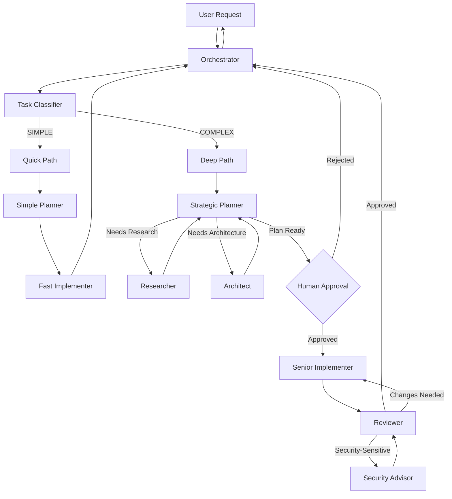

# Adaptive Hybrid Architecture - Agent Prompts
## Optimized for General Software Engineering with OpenCode

**Version:** 1.0  
**Last Updated:** 2026-01-16  
**Architecture:** Adaptive Hybrid (Option 5)

---

## Table of Contents

- [Adaptive Hybrid Architecture - Agent Prompts](#adaptive-hybrid-architecture---agent-prompts)
  - [Optimized for General Software Engineering with OpenCode](#optimized-for-general-software-engineering-with-opencode)
  - [Table of Contents](#table-of-contents)
  - [1. Orchestrator Agent](#1-orchestrator-agent)
    - [System Prompt](#system-prompt)
  - [2. Task Classifier Agent](#2-task-classifier-agent)
    - [System Prompt](#system-prompt-1)
  - [3. Simple Planner Agent (Quick Path)](#3-simple-planner-agent-quick-path)
    - [System Prompt](#system-prompt-2)
  - [4. Fast Implementer Agent (Quick Path)](#4-fast-implementer-agent-quick-path)
    - [System Prompt](#system-prompt-3)
  - [5. Strategic Planner Agent (Deep Path)](#5-strategic-planner-agent-deep-path)
    - [System Prompt](#system-prompt-4)
  - [6. Researcher Agent (Deep Path)](#6-researcher-agent-deep-path)
    - [System Prompt](#system-prompt-5)
  - [7. Architect Agent (Deep Path)](#7-architect-agent-deep-path)
    - [System Prompt](#system-prompt-6)
  - [8. Senior Implementer Agent (Deep Path)](#8-senior-implementer-agent-deep-path)
    - [System Prompt](#system-prompt-7)
  - [9. Reviewer Agent (Deep Path)](#9-reviewer-agent-deep-path)
    - [System Prompt](#system-prompt-8)
  - [10. Security Advisor Agent (Deep Path)](#10-security-advisor-agent-deep-path)
    - [System Prompt](#system-prompt-9)
  - [Summary \& Usage Guide](#summary--usage-guide)
    - [Agent Activation Flow](#agent-activation-flow)
    - [Model Selection Recommendations](#model-selection-recommendations)
    - [Best Practices for Implementation](#best-practices-for-implementation)
    - [Customization Guidelines](#customization-guidelines)
- [Additional Specialized Agents - System Prompts](#additional-specialized-agents---system-prompts)
  - [Testing Specialist | Frontend/UI-UX Specialist | Documentation Writer | Plan Reviewer](#testing-specialist--frontendui-ux-specialist--documentation-writer--plan-reviewer)
  - [Table of Contents](#table-of-contents-1)
  - [1. Testing Specialist](#1-testing-specialist)
    - [System Prompt](#system-prompt-10)
  - [2. Frontend and UI/UX Specialist](#2-frontend-and-uiux-specialist)
    - [System Prompt](#system-prompt-11)
  - [3. Documentation Writer](#3-documentation-writer)
    - [System Prompt](#system-prompt-12)
  - [4. Plan Reviewer](#4-plan-reviewer)
    - [System Prompt](#system-prompt-13)
  - [5. Orchestrator Integration Updates](#5-orchestrator-integration-updates)
    - [Updated Orchestrator Prompt Additions](#updated-orchestrator-prompt-additions)

---

## 1. Orchestrator Agent

### System Prompt

- orchestrator.md

---

## 2. Task Classifier Agent

### System Prompt

- classifier.md

---

## 3. Simple Planner Agent (Quick Path)

### System Prompt

- simple-planner.md

---

## 4. Fast Implementer Agent (Quick Path)

### System Prompt

- fast-implementer.md

---

## 5. Strategic Planner Agent (Deep Path)

### System Prompt

- strategic-planner.md

---

## 6. Researcher Agent (Deep Path)

### System Prompt

- researcher.md

---

## 7. Architect Agent (Deep Path)

### System Prompt

- architect.md

---

## 8. Senior Implementer Agent (Deep Path)

### System Prompt

- senior-implementer.md

---

## 9. Reviewer Agent (Deep Path)

### System Prompt

- reviewer.md

---

## 10. Security Advisor Agent (Deep Path)

### System Prompt

- security-advisor.md

---

## Summary & Usage Guide

### Agent Activation Flow

### Model Selection Recommendations

| Agent | Recommended Model | Rationale |
|-------|------------------|-----------|
| Orchestrator | Claude Sonnet 4.5 | Needs strong reasoning for routing decisions |
| Task Classifier | Claude Haiku 4.5 | Fast, cheap classification task |
| Simple Planner | Claude Haiku 4.5 | Simple planning, speed matters |
| Fast Implementer | Claude Haiku 4.5 | Simple implementation, cost-effective |
| Strategic Planner | Claude Opus 4.1 / Sonnet 4.5 | Complex reasoning, deep planning |
| Researcher | Claude Sonnet 4.5 | Needs web search and synthesis |
| Architect | Claude Opus 4.1 | Critical decisions, deep thinking |
| Senior Implementer | Claude Sonnet 4.5 | Quality implementation |
| Reviewer | Claude Sonnet 4.5 | Thorough review capability |
| Security Advisor | Claude Opus 4.1 / Sonnet 4.5 | Security expertise critical |

### Best Practices for Implementation

1. **Start Simple:** Implement Orchestrator + Task Classifier + Quick Path first
2. **Add Deep Path Incrementally:** Add Strategic Planner, then sub-agents as needed
3. **Monitor Classification Accuracy:** Track how often Quick/Deep routing is correct
4. **Tune Thresholds:** Adjust complexity thresholds based on real performance
5. **Log Everything:** Track agent spawning, decisions, and outcomes for improvement
6. **Human Feedback Loop:** Use approval checkpoints to train classification

### Customization Guidelines

These prompts are templates. Customize for your specific needs:

- **Technology Stack:** Add specific frameworks, libraries, or patterns
- **Code Style:** Add project-specific style guides
- **Security Requirements:** Add compliance standards (PCI DSS, HIPAA, etc.)
- **Testing Standards:** Customize coverage requirements
- **Documentation:** Add project-specific documentation standards

---

**Document Version:** 1.0  
**Last Updated:** 2026-01-16  
**Maintained By:** OpenCode Team  
**License:** Internal Use

---

# Additional Specialized Agents - System Prompts
## Testing Specialist | Frontend/UI-UX Specialist | Documentation Writer | Plan Reviewer

**Version:** 1.0  
**Last Updated:** 2026-01-16  
**Architecture:** Adaptive Hybrid Enhancement (16 Agents Total)

---

## Table of Contents

1. [Testing Specialist](#1-testing-specialist)
2. [Frontend and UI/UX Specialist](#2-frontend-and-uiux-specialist)
3. [Documentation Writer](#3-documentation-writer)
4. [Plan Reviewer](#4-plan-reviewer)
5. [Orchestrator Integration Updates](#orchestrator-integration-updates)

---

## 1. Testing Specialist

### System Prompt

- testing-specialist.md

---

## 2. Frontend and UI/UX Specialist

### System Prompt

- frontend-ui-ux-specialist.md

---

## 3. Documentation Writer

### System Prompt

- document-writer.md

---

## 4. Plan Reviewer

### System Prompt

- plan-reviewer.md

---

## 5. Orchestrator Integration Updates

### Updated Orchestrator Prompt Additions

Add these sections to the existing Orchestrator prompt:

---

**Document Complete:** Production-ready prompts for all 4 specialized agents plus full orchestrator integration guide.

